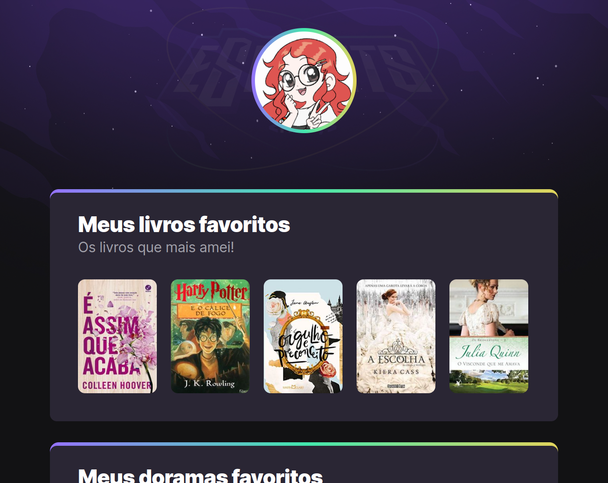

# NLW Esports

## 
 O projeto foi desenvolvido durante o evento Next Level Week da Rocketseat, com algumas modificações feitas por mim. 

 #

## 🚀 Acesse o projeto:
[Clique aqui para acessar](https://anafts.github.io/Nlw-esports-explorer/)
 #

## 🛠️ Technologies: 

# 

## 📚 Aprendizagem 

O pomo bot foi a primeira landing page que desenvolvi, com o projeto aprendi 
- Animações
- pseudo-classe: nth-child()
- Propriedade transform
- Propriedade transition

#

## 💌 Contact-me
Se você gostou do meu projeto, então me segue nas minhas redes sociais. 

  
   
